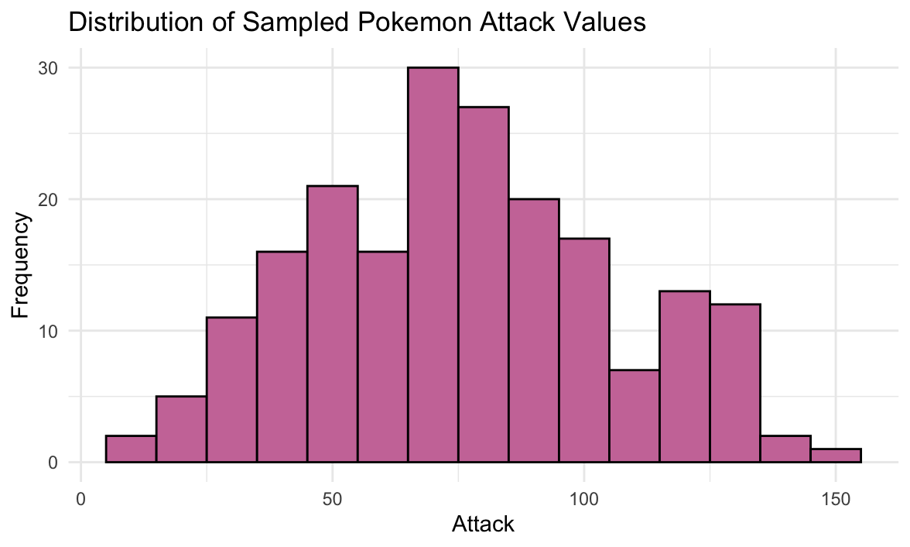
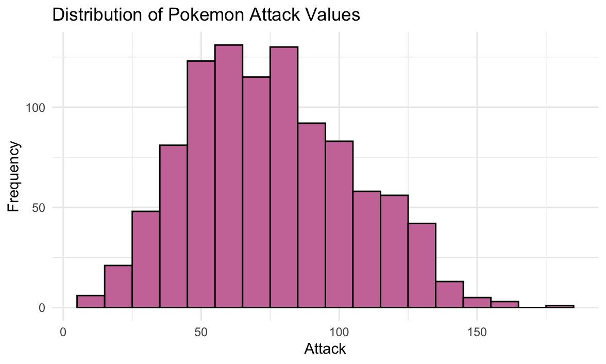

# Pokémon Attack Analysis

An exploratory analysis of Pokémon “Attack” values using a dataset of 1,008 Pokémon. This project computes summary statistics, visualizes the distribution and sampling behavior of the Attack stat, and evaluates normality assumptions.

## Table of Contents

1. [Project Overview](#project-overview)  
2. [Features & Outputs](#features--outputs)  
3. [Prerequisites](#prerequisites)  
4. [Installation](#installation)  
5. [Usage](#usage)  
6. [Script Breakdown](#script-breakdown)  
7. [Interpreting the Results](#interpreting-the-results)  
8. [Extending & Customizing](#extending--customizing)  
9. [Data Source & Citations](#data-source--citations)  
10. [License](#license)  

---

## Project Overview

This analysis focuses on the “Attack” statistic from a Pokémon dataset (`pokemon.csv`, 1,008 entries). We:

- Load and inspect the full Pokémon table.  
- Visualize the **distribution** of Attack values.  
- Compute **mean** and **standard deviation** for the population.  
- Count how many Pokémon fall within 1, 2, and 3 standard deviations of the mean.  
- Assess normality via empirical proportions vs. the 68–95–99.7 rule.  
- Draw a **random sample** of 200 Attack values (with replacement), visualize and summarize it.  
- Compare sample vs. population to discuss sampling accuracy.

All code is contained in `Pokemon_Attack_Analysis.R`, and the key visualizations are saved as `attack-population.png` and `attack-sample.png`.

---

## Features & Outputs

- **Population Histogram** (`attack-population.png`): Attack distribution across all 1,008 Pokémon.  
- **Population Summary**: Mean ≈ 77.17, SD ≈ 29.76.  
- **Empirical Rule Counts**:
  - Within 1 SD: 669 Pokémon (≈ 66.3%).  
  - Within 2 SD: 980 Pokémon (≈ 97.2%).  
  - Within 3 SD: 1,007 Pokémon (≈ 99.9%).  
- **Normality Assessment**: Visual and numeric comparison to expected ~68–95–99.7%.  
- **Sampled Histogram** (`attack-sample.png`): Distribution of 200 random draws of Attack.  
- **Sample Summary**: Sample mean & SD reported, with discussion of sampling error.

<p align="center">
  
</p>

<p align="center">
  
</p>

---

## Prerequisites

- **R** (≥ 4.0) installed on your system.  
- **RStudio** (optional) for interactive development.  
- Internet access to install packages and download the dataset.

### R Packages

- `ggplot2`  
- `dplyr`  

The analysis script will auto-install any missing packages.

---

## Installation

1. **Clone** this repository:
   ```bash
   git clone https://github.com/yourusername/pokemon-attack-analysis.git
   cd pokemon-attack-analysis
   ```

2. **Place** `pokemon.csv` (the full Pokémon dataset) in the project root.

No further build steps are needed.

---

## Usage

1. Open R or RStudio, set the working directory to the project folder:

   ```r
   setwd("path/to/pokemon-attack-analysis")
   ```
2. Run the analysis script:

   ```r
   source("Pokemon_Attack_Analysis.R")
   ```
3. View the two plots and console output:

   * **`attack-population.png`**
   * **`attack-sample.png`**
     And review the printed summary statistics and counts.

---

## Script Breakdown

* **Load Data**

  ```r
  pokemon <- read.csv("pokemon.csv")
  ```
* **Population Visualization**

  * Histogram of `Attack` with `binwidth = 10`.
  * Save as `attack-population.png`.
* **Population Summary**

  * Compute `meanAttack`, `sdAttack`.
  * Count Pokémon within ±1, ±2, ±3 SD.
* **Normality Check**

  * Compare empirical proportions to 68–95–99.7 rule.
* **Sampling**

  * Draw 200 Attack values with replacement.
  * Histogram with same binwidth, save as `attack-sample.png`.
  * Compute sample mean & SD.
* **Interpretation**

  * Print conclusions regarding normality and sampling adequacy.

---

## Interpreting the Results

* The **population histogram** is right-skewed (long tail of high-Attack Pokémon), not perfectly normal.
* **Within 1 SD**: \~ 66.3% vs. expected 68% — close but slightly low.
* **Within 2 SD**: \~ 97.2% vs. expected 95% — slightly higher.
* **Sampling** of 200 shows variability in mean and SD; small sample sizes yield sampling error.
* To better approximate the population, consider larger samples (e.g., \~ 600).

---

## Extending & Customizing

* **Other Stats**: Repeat for `Defense`, `HP`, etc.
* **Binwidth Tuning**: Adjust histogram `binwidth`.
* **Statistical Tests**: Apply Shapiro–Wilk or Kolmogorov–Smirnov.
* **Multiple Samples**: Automate repeated sampling to study sampling distribution.
* **Interactive Plots**: Convert to `plotly` for hover details.

---

## Data Source & Citations

* **Pokémon Dataset**: `pokemon.csv` — contains stats for 1,008 Pokémon.
* **R & Packages**: R Core Team (2023); Hadley Wickham et al. for `ggplot2`, `dplyr`.

---

## License

This project is released under the **MIT License**. See [LICENSE](LICENSE) for full details.
